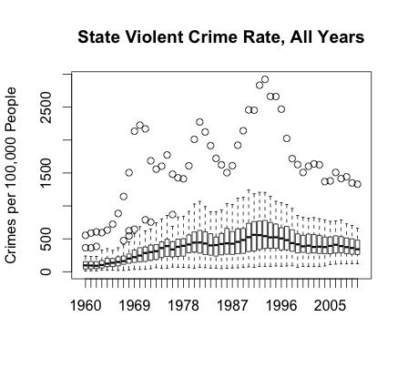
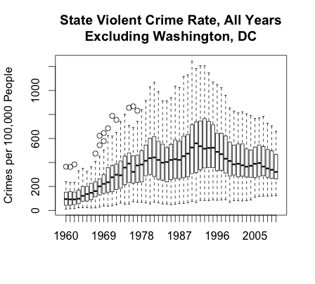

*by Ari Lamstein*

As the author of an [R mapping package](https://github.com/arilamstein/choroplethr) I am always on the lookout for interesting datasets that lend themselves to mapping. I recently stumbled across the [US State Violent Crime Rate](https://www.quandl.com/data/FBI_UCR/USCRIME_TYPE_VIOLENTCRIMERATE-U-S-Crimes-by-crime-Violent-Crime-Rate) dataset and decided to explore it in more depth.

The code for this app is available [here](https://github.com/arilamstein/state-crime-analysis). If you have any comments or notice any errors, please contact me via [twitter](https://twitter.com/AriLamstein).

## 1. Boxplots

The dataset is aggregated by state and by year. My first step was to create a boxplot of the data by year. This led me to the surprising conclusion that Washington, DC is an outlier: its violent crime rate is significantly higher than that of other regions in the dataset.

Viewing the graphs with and without Washington, DC shows just how much of an outlier it is. Also, there is a clear increase in violent crime from 1960 to the mid 1990s, followed by a gradual decrease.
